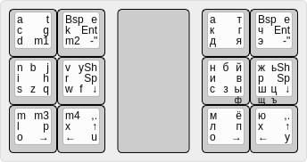

# Touch slide keyboard Slidest40

Layouts: http://www.keyboard-layout-editor.com/#/gists/4b5c5b166e76bcb102af3a5adc02eba1

Code: [Arduino](Arduino/)

Controller: Pro Micro

Library: https://github.com/adafruit/Adafruit_MPR121

Copy `Adafruit_MPR121.h` and `Adafruit_MPR121.cpp` files to Arduino directory.
