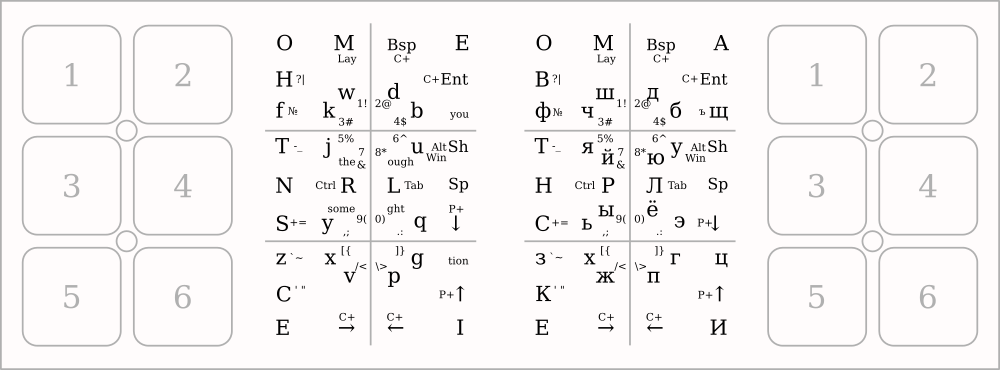

# Touch slide keyboard Slidest-40

Printing is done by touching or holding your finger through the touch areas. For example, to print the letter O, you need to touch area 1, H - hold from area 1 to 3 (slide `13`), W - `124`, the number 1 is `1243`.

...

Code: [Arduino](Arduino/)

Controller: Pro-Micro and Adafruit-MPR121

Library: https://github.com/adafruit/Adafruit_MPR121

Copy `Adafruit_MPR121.h` and `Adafruit_MPR121.cpp` files to `Arduino` directory.

---

# Сенсорная слайдовая клавиатура Слайдость-40

Печать производится прикосновением или проведением пальца через сенсорные области. Например, для печати буквы О необходимо прикоснуться к области 1, В - провести из области 1 к 3 (слайд `13`), Ш - `124`, цифра 1 это `1243`, восклицательный знак ! - `12431`.

## Управляющие слайды

Переключение раскладок: английская - `1213`, русская - `12135`    
Backspace - `21`, Ctrl+Backspace - `212`  
Delete - `121`, Insert - `2124`  
Стрелки: вверх - `64`, вниз - `46`, влево - `65`, вправо - `56`  
Перемещение по словам: Ctrl+Left - `656`, Ctrl+Right - `565`  
PageUp - `646`, PageDown - `464`  
Tab - `43`, Esc - `4341`  
Enter - `24`, Ctrl+Enter - `242`

Режим Alt+Tab - `4346`, после чего +Tab - `34` или +Shift+Tab - `43`, и +Left - `65` или +Right - `56` (в разных оконных оболочках переключение внутри Alt+Tab осуществляется по-разному), выход из режима (и отпускание Alt) - клик на любое поле.

## Модификаторы

Модификаторы: Shift - `42`, Ctrl - `343`, Alt - `424`, Win - `4246`, отпустить нажатые модификаторы - `4243`, можно и пробелом - `4`, при печати любого символа модификаторы отпускаются, а вот при работе с управляющими кнопками остаются нажатыми. Для печати пробела с модификаторами слайд `4346` (Alt+Tab который) становится пробелом (если выбраны какие-либо модификаторы). На левой половине набираются левые модификаторы, на правой - правые.

## Функциональные кнопки

Функциональные кнопки это более длинный круговой слайд чем знаки на цифрах, например, если 1 это `1243`, ! это `12431`, то F1 это будет `124312`, и так до F12 - `465346`, затем идут Caps Lock, Scroll Lock, Print Screee, Pause/Break.

## Цифровой блок
Слой цифрового блока - `12134`, выход таким же слайдом или переключением в английскую или русскую раскладки. Слайды четверные как цифры, либо тройные короче цифр. Распределение кнопок по слою следующее: 1234567890, Num Lock, точка или запятая (зависит от выбранной раскладки), -+/*

Находясь в слое цифрового блока можно выбрать операционную систему, Linux - `3431`, Windows - `3134`, MacOS - `3534`, Android - `3435`, различие в переключении раскладок, Shift+Alt, Shift+Ctrl, Cmd+Space или Win+Space (это одно и то же), и в MacOS-режиме меняются местами модификаторы Ctrl и Cmd (Win).

Цифровой блок есть и на основных слайдах, чтобы не переключаться в другой слой при клавиатурных сочетаниях, ещё более длинный круговой слайд чем фунциональный, например, если F1 это `124312`, то 1 это будет `1243124`.

## Знаки

Знаки печатаются в любой раскладке, если они в текущей отсутвуют, то произойдёт переключение в противопроложную раскладку, печать знака, и переключение обратно. То есть, из русской раскладки можно печатать отсутствующие в ней символы `~@#$^&[]{}<>|, а из английской можно напечатать знак №.

## Умножитель

Слайды навигации задействуют _принцип умножителя_, если на противоположной половине клавиатуры зажать область, а на текущей ввести управляющий слайд, то он будет нажат указанное число раз по номеру зоны, вместо единицы будет нажат Ctrl, 5 это умножитель 10, 6 - умножитель 20. Например, чтобы удалить три символа, можно прикоснуться к области `3`, а на другой половине провести слайд Backspace - `21`, а для перемещения по словам можно использовать не слайды с Ctrl (например, на слово влево Ctrl+Left - `656`), а зажать `1` и вводить слайд `65` сколько нужно раз.

## Юникод

Есть слайды для ввода юникод-символов (пока лишь несколько и в Linux, ещё в разработке).

Коды символов:  
– `3131`, — `31353`
« `564353`, » `653464`  
× `431242`, ÷ `56434`  
° `1343`

## Ссылки

Код: [Arduino](Arduino/)

Контроллер: Pro-Micro и Adafruit-MPR121

Библиотека: https://github.com/adafruit/Adafruit_MPR121

Скопируйте файлы `Adafruit_MPR121.h` и `Adafruit_MPR121.cpp` в директорию `Arduino`.
